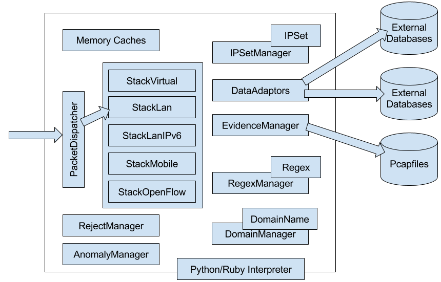

=========================
AIEngine description
=========================

.. contents:: Table of Contents

Introduction
------------
The aim of this document is to explain and describe the functionality that AI Engine a New Generation Network Intrusion Detection System engine brings.

AIEngine is a next generation programmable network intrusion detection system. Supports x86_64, ARM and MIPS architecture over operating systems such as Linux, FreeBSD and MacOS.

.. raw:: pdf

   PageBreak

Architecture
------------

The core of AIEngine is a complex library implemented on C++11/14 standard that process packets on real time. This library uses a external layer of high level programming languages, such as Python, Ruby or even Java, that brings to the engine the flexibility of this type of languages and the speed and performance of C++14 standard.

All the internal architecture is based on objects that could link or not, depending on customer requirements, with other objects for bring a specific functionality. On the other hand, all the memory connections have internal caches that allows to the system to process more than 5.000.000 concurrent TCP connections with no memory problems.

The system supports the most import protocols for different use cases.

* Banking environments. Support for Bitcoin that allows to the customers monitors, controls and detect potential anomalies on their mining infrastructures.
* IoT infrastructures. Support for the most used protocols for the Internet of Things, and also due to the architecture of the system, could be embedded on small devices.
* Data center environments. Support for the most used protocols for data centers for detect anomalies and potential attacks.
* IMS environments. Nowadays, VoIP servers are target of different type of attacks. The proposed systems brings security to SIP servers in order to deal with the new threats of today.
* Industrial infrastructures. Now is critical to have security systems on Industrial infrastructures that could potentially be attacked. The system implements the most common protocols for this type of environments, bringing more intelligence to the upper layers.

The engine is design to support different network environments such as:

* StackLan: Designed for enterprises based on LAN architectures with MPLS or VLans.
* StackMobile: Designed for Mobile operators that needs security on their GN interfaces for secure their base customers.
* StackLanIPv6: Designed for support IPv6 on LAN architectures.
* StackVirtual: Designed for big data centers that support VxLAn on their architecture.
* StackOpenflow: Designed for data centers that supports OpenFlow (experimental).
* StackMobileIPv6: Designed for Mobile IPv6 operators that needs security on their GN interfaces.

AIEngine supports the programming of customer requirements code on real time. This brings to the engine the capability of deal with new threats with a reacting time close to zero. This code is written in a function that have one parameter, the TCP/UDP connection object, and we called "callbacks". These callbacks can be plugged on different objects.

.. code:: ruby

    # Ruby callback

    def callback_domain(flow)
      print "Malware domain on:%s" % flow 
    end

    d = DomainName.new("Malware domain" ,".some.dns.from.malware.com")
    d.callback = method(:callback_domain)

.. code:: python

    """ Python callback on HTTP traffic """
    
    def callback_zeus(flow):
        h = flow.http_info
        if (h):
            host = str(h.host_name)
            if (host):
                print("Suspicious activity detected on flow", str(flow), host)
                flow.label = "ZeuS malware detected"

    d1 = DomainName("Domain from ZeuS botnet", ".malware.zeus.com")
    d1.callback = callback_zeus
    
    d2 = DomainName("Domain from ZeuS botnet", ".malwarecdn.zeus.com", callback_zeus)

.. code:: java

    // Java callback example

    class ExternalCallback extends JaiCallback{
        public void call(Flow flow) {
            HTTPInfo s = flow.getHTTPInfoObject();
            // Process the HTTPInfo object 
        }
    }

    DomainName d = new DomainName("Generic domain",".generic.com");
    DomainNameManager dm = new DomainNameManager();
    ExternalCallback call = new ExternalCallback();

    d.setCallback(call);
    dm.addDomainName(d);

.. code:: lua

   -- Example of Lua callback

   function domain_callback(flow)
       print("Malware domain on:%s", tostring(flow))
   end

   d = luaiengine.DomainName("Malware domain", ".adjfeixnexeinxt.com")

   dm = luaiengine.DomainNameManager()
   d:set_callback("domain_callback")
   dm:add_domain_name(d)

.. raw:: pdf

   PageBreak

Features
--------

AIEngine supports the following features on version 1.9

.. raw:: pdf

   PageBreak

Supported protocols
~~~~~~~~~~~~~~~~~~~
The engine support the following protocols:

* Bitcoin
    Bitcoin is a new way of generate and interchange money (more info). The system is able to manage the most common options of the protocol, such us, transactions, getdata, getblocks operations and so on.

* CoAP
    The Constrained Application Protocol (CoAP) is a specialized web transfer protocol for use with constrained nodes and constrained networks in the Internet of Things (IoT). It is particularly targeted for small low power sensors, switches, valves and similar components that need to be controlled or supervised remotely, through standard Internet networks.

* DCERPC
    The Distributed Computing Environment / Remote Procedure Calls (DCERPC) is a protocol designed for write distributed software.

* DHCPv4/DHCPv6
    The Dynamic Host Configuration Protocol (DHCP) provides a quick, automatic, and central management for the distribution of IP addresses within a network.

* DNS
    The Domain Name Service (DNS) is one of the most used protocols on the Internet. DNS provides a way to know the IP address of any host on the Internet. It is no different than any other directory service. From cover channels to Trojans and other type of malware uses DNS for communicate their services. 

* ETHERNET
    This is the most important protocol for carry LAN datagrams....(TODO).

* GPRS
    The system supports G3 and G4 GPRS versions. This is the most common protocol for Mobile operators on the GN interface.

* GRE
    Nowadays tunnels are very important on Cloud environments. Most of this systems uses isolation of the network in order to prevent security problems with different virtual systems. GRE is one of the most important tunnels system that allows network isolation. Our system supports this protocol in order to bring security to cloud environments.

* HTTP 1.1
    Today HTTP is the most used protocol on the Internet. Also, the majority of the exploit attacks, Trojans, and other type of malware uses this protocol in order to commit different type of ciber-crimes. The proposed system implements a specific HTTP protocol that supports the HTTP 1.1 standard in order to  support multiple request on the same network conversation. 

* ICMPv4/ICMPv6
    The Internet Control Message Protocol (ICMPv4 and ICMPv6) is one of the main protocols of the internet protocol suite. It is used by network devices, like routers, to send error messages indicating, for example, that a requested service is not available or that a host or router could not be reached. Denial of service attacks have been doing by using this protocol, so is key to the system to monitor and react under this type of attacks.

* IMAP
    The Internet Message Access Protocol (IMAP) is an Internet standard protocol used by e-mail clients to retrieve e-mail messages from a mail server over a TCP/IP connection. Attacks that uses invalid credentials or other type of attacks needs to be addresses.

* IPv4/IPv6
    The Internet Protocol (IPv4 and IPv6) is the main communications protocol in the Internet protocol suite for relaying datagrams across network boundaries. This protocol have been involved in many type of attacks, such as fragmentation attacks and so on.

* MPLS
    Multi-Protocol Label Switching (MPLS) provides a mechanism for forwarding packets for any network protocol. MPLS flows are connection-oriented and packets are routed along pre-configured Label Switched Paths (LSPs). All the Network stacks of the system supports MPLS in any of their types.

* Modbus
    Modbus TCP is a communications protocol for use with its programmable logic controllers (PLCs). Simple and robust, it has since become a de facto standard communication protocol, and it is now a commonly available means of connecting industrial electronic devices. This protocol is very important for Industrial systems that needs to monitor and secure their platforms what uses this type of devices.

* MQTT
    MQTT is a publish/subscribe messaging protocol designed for lightweight M2M communications. It was originally developed by IBM and is now an open standard.

* Netbios
    Netbios is a protocol designed for comunication of computers over a LAN.

* NTP
    The Network Time Protocol (NTP) is widely used to synchronize computer clocks in the Internet. The protocol is usually described in terms of a client-server model, but can as easily be used in peer-to-peer relationships where both peers consider the other to be a potential time source. One of the biggest DDoS attacks was made by using this protocol.

* OpenFlow
    OpenFlow is an open standard network protocol used to manage traffic between commercial Ethernet switches, routers and wireless access points. Nowadays, data-centers uses this standard to reduce costs and to manage their networks.

* POP
    The Post Office Protocol (POP) is an application-layer Internet standard protocol used by local e-mail clients to retrieve e-mail from a remote server over a TCP/IP connection. With this protocol users could manage their e-mail for download, delete, store and so on.

* Quic
    The Quic protocol (Quick UDP Internet Connections) is a experimental protocol designed by Google that its goal is to improve perceived performance of connection-oriented web applications that are currently using TCP.

* RTP
    The Real-time Transport Protocol (RTP) defines a standard packet format for delivering audio and video over the Internet. It is defined in RFC 1889. RTP is used extensively in communication and entertainment systems that involve streaming media, such as telephony, video applications, television services and web-based push-to-talk features.

* SIP
    The Session Initiation Protocol (SIP) is an application-layer control (signaling) protocol for creating, modifying, and terminating sessions with one or more participants. These sessions include Internet telephone calls, multimedia distribution, and multimedia conferences. This protocol is used for establish VoIP sessions.

* SMB
    The Server Message Block (SMB) is as an application-layer network protocol used for providing shared access to files in general.

* SMTP
    The Simple Mail Transfer Protocol (SMTP) is a communication protocol for mail servers to transmit email over the Internet. SMTP provides a set of codes that simplify the communication of email messages between email servers. On the other hand, spammers use this protocol to send malware and spam over the Internet.

* SNMP
    The Simple Network Management Protocol (SNMP) is a popular protocol for network management. It is used for collecting information from, and configuring, network devices, such as servers, printers, hubs, switches, and routers on a IP network. SNMP exposes management data in the form of variables on the managed systems, which describe the system configuration. These variables can then be queried (and sometimes set) by managing applications. SNMP have been involved on DDoS reflection attacks on the past, so the system could detect this type of attack and notifies to other systems.

* SSDP
    The Simple Service Discovery Protocol (SSDP) is a network protocol based on the IP suite for advertisement and discovery of network services and presence information. The SSDP protocol can discover Plug & Play devices, with uPnP (Universal Plug and Play). SSDP uses unicast and multicast address (239.255.255.250). SSDP is HTTP like protocol and work with NOTIFY and M-SEARCH methods. This protocol is used for the IoT for discover devices basically.

* SSH
    The Secure Shell (SSH) is a network protocol for operating network services securely over an unsecured networks by using cryptographic functions.

* SSL
    SSL stands for Secure Sockets Layer and was originally created by Netscape. SSLv2 and SSLv3 are the 2 versions of this protocol (SSLv1 was never publicly release). After SSLv3, SSL was renamed to TLS. TLS stands for Transport Layer Security and started with TLSv1.0 which is an upgraded version of SSLv3. The primary goal of the TLS protocol is to provide privacy and data integrity between two communicating computer applications. 

* TCP
    The Transmission Control Protocol (TCP) is a transport layer protocol used by applications that require guaranteed delivery. It is a sliding window protocol that provides handling for both timeouts and retransmissions. On the other hand, TCP establishes a full duplex virtual connection between two endpoints, wherever, each endpoint is defined by an IP address and a TCP port number. The operation of TCP is implemented as a finite state machine. A big varialty of DDoS attacks have been done in the past and recently, incorrect flags, incorrect lengths, offsets and so on.

* UDP
    The User Datagram Protocol (UDP) is an alternative communications protocol to TCP used primarily for establishing low-latency and loss tolerating connections between applications on the Internet.

* VLAN
    A virtual LAN (VLAN) is any broadcast domain that is partitioned and isolated in a computer network at the data link layer. VLANs are use to provide the network segmentation services traditionally provided only by routers in LAN configurations.

* VXLAN
    Virtual Extensible LAN (VXLAN) is a proposed encapsulation protocol for running an overlay network on existing Layer 3 infrastructure. The primary goal of VXLAN is to extend the virtual LAN (VLAN) address space by adding a 24-bit segment ID and increasing the number of available IDs to 16 million.

.. raw:: pdf

   PageBreak

IPSet matching
~~~~~~~~~~~~~~
Most of the engines allows to add sets of IP address in order to monitor or track specific hosts. The engine allows this functionality in a easy way by using the classes IPSet and IPRadixTree. The following example shows how load the IP address from the ToR network and load onto the engine.

.. code:: python

    ipset = IPSet()

    ipset_mng = IPSetManager()
    ipset_mng.add_ip_set(ipset)

    """ Take a big list of IP address that belongs to ToR """
    req = urllib2.Request("https://www.dan.me.uk/torlist/")
    try:
        response = urllib2.urlopen(req)
        for line in response.readlines():
            ip = line.strip()
            try:
    	        socket.inet_aton(ip)
            except:
    	        continue
            ipset.add_ip_address(ip)
    except urllib2.URLError as e:
        print("Error:", e)

    """ Sets the IPSetManager on the stack for TCP traffic """
    st.tcp_ip_set_manager = ipset_mng

The comparison about the performance betwwen the IPSet and a IPRadixTree is the following

test 1 is a IPSet with 50.000 ip addresses

.. code:: python
    
    IPSet (IPs)
	Total IP address:            50188
	Total lookups in:                0
	Total lookups out:          192752

test 2 is a IPRadixSet with 50.000 ip addreses

.. code:: python
    
    IPRadixTree (Tree IPs)
	Total IP address:            50188
	Total IP networks:               0
	Total lookups in:                0
	Total lookups out:          192752

test 3 is a IPRadixSet with 9100 B networks covering the 50.000 ip addresses

.. code:: python
    
    IPRadixTree (Tree IPs)
	Total IP address:                0
	Total IP networks:            9109
	Total lookups in:            67137
	Total lookups out:          125615

test 4 is a IPRadixSet with 29800 C networks covering the 50.000 ip addresses

.. code:: python

    IPRadixTree (Tree IPs)
	Total IP address:                0
	Total IP networks:           29879
	Total lookups in:              108
	Total lookups out:          192644

test 5 is a IPBloomSet with 50.000 ip addresses

.. code:: python

    IPBloomSet IPs
	False positive rate:             1
	Total IP address:            50188
	Total lookups in:             2566
	Total lookups out:          190186

+----------+-----------+----------+---------+
| Test     | incl      | heap     |memory   |
+==========+===========+==========+=========+
| Test 1   | 4997404   | 4 MB     | 32,6 MB |
+----------+-----------+----------+---------+
| Test 2   | 693964459 | 8 MB     | 49,9 MB |
+----------+-----------+----------+---------+
| Test 3   | 214737201 | 4,3 MB   | 34,8 MB |
+----------+-----------+----------+---------+
| Test 4   | 245537425 | 5,8 MB   | 42,6 MB |
+----------+-----------+----------+---------+
| Test 5   | 395515316 | 3,6 MB   | 31,7 MB |
+----------+-----------+----------+---------+

The total number of lookups was 192752.

.. raw:: pdf

   PageBreak

Regex graphs
~~~~~~~~~~~~
Nowadays attacks get complex and complex and with Regex Graphs the user is able to generate any complex detection by using graphs. No matter how complex is the attack on the network flow.  Complex detection patterns can be done with this functionality.

.. code:: python

    """ Create a basic regex for match generic SSL traffic """
    ssl_sig = Regex("SSL Basic regex", b"^\x16\x03")

    """ Create another regex for match the heartbeat packets of SSL """
    sig = Regex("SSL Heartbeat", b"^.*\x18\x03(\x01|\x02|\x03).*$")

    """ Link both regex expressions """
    ssl_sig.next_regex = sig

    """ Add the main regex to the variable sm of type RegexManager """
    sm.add_regex(ssl_sig)

    """ Link the sm to the current network stack """
    st.tcp_regex_manager = sm

.. raw:: pdf

   PageBreak

Domain matching
~~~~~~~~~~~~~~~
The system support domain names matching for the protocols HTTP, DNS, SMTP and SSL. Over HTTP the field Host will be evaluated with a DomainManager that will evaluate if some of the domains matches.

.. code:: ruby

  d = DomainManager.new
  dom = DomainName.new("Domain from my site", ".videos.mysite.com")
  d.add_domain_name(dom)

  s.set_domain_name_manager(d, "HTTPProtocol")

Also by using DomainNames is possible to generate a sub set of Regex objects. With this functionality the Regex will be more accurate and generate less false positives. For enable this is just as simple as assign a value to a variable.

.. code:: python

  rm = RegexManager()
  dom = DomainName("My specific domain", ".customer1.isp.com")
  dom.regex_manager = rm

This functionality is perfect for analyze content on HTTP traffic for unknown malware.

On the DNSProtocol the matching of a specific DNS generates on the data output a JSON packet with all the IPS of the DNS response. This brings to the system the capability to provide DNS records with the IP address response in order to generate threat intelligence.

.. code:: json

  {
    "bytes": 508,
    "info": {
        "dnsdomain": "bubuserve.com",
        "ips": [
            "164.9.107.24",
            "164.9.107.29",
            "164.9.107.12",
            "164.9.107.23",
            "164.9.107.13",
            "164.9.107.16",
            "164.9.107.30",
            "164.9.107.21"
        ],
        "matchs": "Generic domain",
        "qtype": 0
    },
    "ip": {
        "dst": "198.164.30.2",
        "src": "192.168.5.122"
    },
    "layer7": "dns",
    "port": {
        "dst": 53,
        "src": 10886
    },
    "proto": 17
  }

For more details, see `Zeus malware`_ .

.. raw:: pdf

   PageBreak

Ban domain
~~~~~~~~~~
Nowadays the quantity of traffic on the networks is massive, according to bla bla (some references). With this functionality we can exclude traffic that just consume resources on the engine. Facebook, twitter and this services could be used on this. This functionality is used on protocols like HTTP, DNS, SMTP and SSL.

.. code:: python

  d = DomainManager
  for dom in list_banned_domains:
      d.add_domain_name(DomainName("Banned domain", dom))
  
  st.set_domain_name_manager(d, "http")
  
.. raw:: pdf

   PageBreak

Memory management
~~~~~~~~~~~~~~~~~

The engine provides two modes of memory management:

- Allocate the memory on boot time (All the memory is allocated when the program starts).

- Allocate the memory dynamically (The memory is allocated depending on the network traffic).

Both modes provides advantages and disadvantages, so depending on your requirements you can choose the model that you want. For example, if you want to run the engine for analyses DNS for malware or monitor Bitcoin transactions, probably your model will be static because you want to allocate all the memory for specific type of traffic. On the other hand, if your system should work as Network Intrusion probably a dynamic mode will be better for you.

All the allocated memory could be clean an refresh in order to have fresh information.

The system provides functionality to increase or decrease specific items of a given protocol, this is useful with static allocation. This allows to make specific configurations for a given protocol. For example a dedicated DNS monitor system what could handle 1.000.000 queries.

.. code:: python

   st = StackLan()

   st.tcp_flows = 0
   st.udp_flows = 1000000

   """ Decrease the memory of the rest of UDP protocols """
   st.decrease_allocated_memory(500000, "sip")
   st.decrease_allocated_memory(500000, "ssdp")

   """ Increase the DNSInfos of the DNS protocol """
   st.increase_allocated_memory(1000000, "DNSProtocol")

.. raw:: pdf

   PageBreak

DDoS support
~~~~~~~~~~~~
The engine have mechanisms for support denial of service attacks in the majority of the protocols supported. However, for some complex DDoS attacks the engine is capable to accept specific customer requirements for specific attacks. For using this functionality we use the method add_timer of the PacketDispatcher. This method with combination of the methods get_counters and get_cache from any of the stacks, allows the user to create complex DDoS attack scenarios for a data centers. On the other hand, by using the add_timer method we can schedule task at different times for doing different things, for example find all the connections to a given host that excedes a given quota, get the metrics of a protocol and use a third party framework for math analisys and anomaly detection, and so on.

Here is a basic example for detect TCP syn attacks with ruby.

.. code:: ruby

  def scheduler_handler_tcp

    print "TCP DoS Checker\n"
    c = @s.get_counters("TCPProtocol")
  
    # Code the intelligence for detect DDoS based on 
    # combination flags, bytes, packets and so on. 
    syns = c["syns"]
    synacks = c["synacks"]
    if (syns > (synacks * 100))
      print "System under a SYN DoS attack\n"
    end
  end

Another example for detect attacks over NTP on python

.. code:: python

  def scheduler_handler_ntp():

      total_ips = dict()
      print("NTP DDoS Checker")
      c = st.get_counters("NTPProtocol")

      # Count the number different ips of the NTP flows
      for flow in st.udp_flow_manager:
          if (flow.l7_protocol_name == "NTPProtocol"):
              total_ips[flow.src_ip] = 1

      if (total_ips.len() == len(fu)):
          print("System under a NTP DDoS attack")

  """ On the PacketDispatcher set a timer every 10 seconds """
  pd.add_timer(scheduler_handler_ntp, 10)

All the protocols supports the usage of the stack method get_counters, that allows to extract crucial information from any of the protocols.

You can use this mechanism for detect anomalies that depends on the time and send alerts to other systems.

.. code:: python

  def fragmentation_handler():

      ipstats = st.get_counters("IP")

      current_ip_packets = ipstats["packets"]
      current_fragmented = ipstats["fragmented packets"]

      if (current_fragmented  > previous_fragments + delta):
          sent_alert("ALERT: IP Fragment attack on the network")

      previous_ip_packets = current_ip_packets
      previous_fragments = current_fragmented

  """ On the PacketDispatcher set a timer every 20 seconds """
  pd.add_timer(fragmentation_handler, 20)

.. code:: python

   """ Get statistics of the BitcoinProtocol """
   c = st.get_counters("bitcoin")
   print(c)
   {'transaction': 1450, 'get blocks': 200, 'network addr': 4, 'packets': 14963,
    'inv': 1, 'reject': 0, 'bytes': 1476209, 'ping': 0, 'not found': 0, 
    'alert': 0, 'headers': 0, 'getaddr': 24, 'version': 0, 'version ack': 34,
    'get headers': 12, 'pong': 0, 'getdata': 126, 'mempool': 0, 'block': 0}
    

.. raw:: pdf

   PageBreak

Bloom filter support
~~~~~~~~~~~~~~~~~~~~
When the customer requirements needs to track a big number of IP addresses, the IPSets are not enough. For this case, the system implements a bloom filter functionality in order to support this requirement. Notice that bloom filters are fault tolerant caches, so false positives and false negatives could happen. However, depending on the number of IP Address we could recommend their usage.

This option needs to be set on compilation time (--enable-bloomfilter) and also have the boost bloomfilter libraries on the system.

.. raw:: pdf

   PageBreak

Reject TCP/UDP connections
~~~~~~~~~~~~~~~~~~~~~~~~~~
Under some attacks the engine is capable of closing UDP and TCP connections in order to reduce the pressure on the servers and also to disturb the origin of the attack. This functionality is only available on StackLans and StackLanIPv6 for the moment.

.. code:: python

  def some_handler(flow):
      """ Some code on the flow """
      flow.reject = True

.. raw:: pdf

   PageBreak

External labeling
~~~~~~~~~~~~~~~~~
On some cases, the customer may want to label the communication with a personalized label, depending their needs. The system allows to label any Flow in order to label traffic as customer wants in a easy way.

.. code:: python

  def callback_for_http(flow):
    """ Call to some external service to verify the reputation of a domain """
    h = flow.http_info
    flow.label = external_domain_service(h.host_name)

Services as IP reputation, Domain reputation, GeoIP services could be used and label depending their return value.

.. raw:: pdf

   PageBreak

Data integration
~~~~~~~~~~~~~~~~
One of the biggest challenges of the engine is to allows to send the information to any type of database system. Nowadays, systems like 
`MySQL`_, `Redis`_, `Cassandra`_, `Hadoop`_ are on top of any company. By using the functionality of the DatabaseAdaptors, any integration could be possible with a negligible integration time.

For support multiple data destination we just need to generate a class and define the next methods:

* insert. This method will be called when a new UDP or TCP connection will be created.
* update. This method is called for update the information of the connection, and also when some important event happens.
* remove. This method is when the connection closes or dies by timeout.

For more information about adaptors, see `Database integration`_ . 

The information given on the update method is encode on JSON, but in some specific cases the system could generate MSGPack.

So just choose or write your adaptor and plugin to the stack as the example bellow

.. code:: python

    st = pyaiengine.StackLan()

    st.tcp_flows = 163840
    st.udp_flows = 163840

    # Use your own adaptor (redisAdaptor, cassandraAdaptor, hadoopAdaptor, or whatever)
    db = redisAdaptor()
    db.connect("localhost")

    st.set_udp_database_adaptor(db, 16)

    with pyaiengine.PacketDispatcher("eth0") as pd:
        pd.stack = st
        pd.run()

Here is the information that the engine provides on JSON format.

Bitcoin data
************

.. code:: json

  { 
    "bytes": 1664909,
    "info": {
        "blocks": 2,
        "rejects": 0,
        "tx": 6,
        "tcpflags": "Flg[S(1)SA(1)A(1662)F(0)R(0)P(8)Seq(1410785638,4110238515)]"
    },
    "ip": {
        "dst": "192.168.1.25",
        "src": "192.168.1.150"
    },
    "layer7": "BitcoinProtocol",
    "port": {
        "dst": 8333,
        "src": 55317 
    },
    "proto": 6
  }

CoAP data
*********

.. code:: json

  {
    "bytes": 233,
    "info": {
        "host": "someiot.com",
        "uri": "/some/resource/data/"
    },
    "ip": {
        "dst": "192.168.1.2",
        "src": "192.168.1.10"
    },
    "layer7": "CoAPProtocol",
    "port": {
        "dst": 5683,
        "src": 5531 
    },
    "proto": 17
  }

DCERPC data
***********

.. code:: json

  {
    "bytes": 2963,
    "info": {
        "tcpflags": "Flg[S(1)SA(1)A(14)F(0)R(0)P(9)Seq(3465082406,629632508)]",
        "uuid": "afa8bd80-7d8a-11c9-bef4-08002b102989"
    },
    "ip": {
        "dst": "192.168.3.43",
        "src": "10.0.2.15"
    },
    "layer7": "dcerpc",
    "port": {
        "dst": 49302,
        "src": 51296
    },
    "proto": 6
  }

DHCP data
*********

.. code:: json

  {
    "bytes": 300,
    "info": {
        "hostname": "EU-JOHN2"
    },
    "ip": {
        "dst": "255.255.255.255",
        "src": "192.168.3.3"
    },
    "layer7": "DHCPProtocol",
    "port": {
        "dst": 67,
        "src": 68 
    },
    "proto": 17
  }

DHCPv6 data
***********

.. code:: json

  {
    "bytes": 94,
    "info": {
        "hostname": "TSE-MANAGEMENT"
    },
    "ip": {
        "dst": "ff02::1:2",
        "src": "fe80::bc5a:f963:5832:fab"
    },
    "layer7": "dhcp6",
    "port": {
        "dst": 547,
        "src": 546
    },
    "proto": 17
  }

DNS data
********

.. code:: json

  {
    "bytes": 304,
    "info": {
        "dnsdomain": "youtube-ui.l.google.com",
        "ips": [
            "74.125.93.190",
            "74.125.93.136",
            "74.125.93.93",
            "74.125.93.91"
        ],
        "matchs": "Generic",
        "qtype": 1
    },
    "ip": {
        "dst": "198.164.30.2",
        "src": "192.168.5.122"
    },
    "layer7": "dns",
    "port": {
        "dst": 53,
        "src": 45428
    },
    "proto": 17
  }

HTTP data
*********

.. code:: json

  {
    "bytes": 9785,
    "info": {
        "ctype": "text/html",
        "host": "www.sactownroyalty.com",
        "reqs": 1,
        "ress": 1,
        "tcpflags": "Flg[S(1)SA(1)A(14)F(0)R(0)P(1)Seq(1008125706,1985601735)]"
    },
    "ip": {
        "dst": "74.63.40.21",
        "src": "192.168.4.120"
    },
    "layer7": "http",
    "port": {
        "dst": 80,
        "src": 3980
    },
    "proto": 6
  }

IMAP data
*********

.. code:: json

  {
    "bytes": 1708,
    "info": {
        "tcpflags": "Flg[S(1)SA(2)A(21)F(0)R(0)P(18)Seq(3603251617,2495559186)]",
        "user": "\"user11\""
    },
    "ip": {
        "dst": "192.168.5.122",
        "src": "192.168.2.111"
    },
    "layer7": "imap",
    "port": {
        "dst": 143,
        "src": 4479
    },
    "proto": 6,
    "reputation": "Suspicious"
  }

MQTT data
*********

.. code:: json

  {
    "bytes": 2509,
    "info": {
        "operation": 11,
        "total_client": 4,
        "total_server": 7,
        "tcpflags": "Flg[S(1)SA(1)A(22)F(1)R(0)P(10)Seq(2637347154,3369099113)]"
    },
    "ip": {
        "dst": "192.168.1.7",
        "src": "10.0.2.15"
    },
    "layer7": "MQTTProtocol",
    "port": {
        "dst": 1883,
        "src": 24479
    },
    "proto": 6
  }

Netbios data
************

.. code:: json

  {
    "bytes": 50,
    "info": {
        "netbiosname": "ISATAP"
    },
    "ip": {
        "dst": "192.168.100.7",
        "src": "192.168.100.201"
    },
    "layer7": "NetbiosProtocol",
    "port": {
        "dst": 137,
        "src": 137 
    },
    "proto": 17
  }

SSH data
********

.. code:: json

  {
    "bytes": 22908,
    "info": {
        "crypt_bytes": 18428,
        "handshake": false,
        "tcpflags": "Flg[S(1)SA(1)A(366)F(0)R(0)P(209)Seq(3089519785,974637779)]"
    },
    "ip": {
        "dst": "2003:51:6012:121::2",
        "src": "2003:51:6012:110::b15:22"
    },
    "layer7": "ssh",
    "port": {
        "dst": 22,
        "src": 60892
    },
    "proto": 6
  }

SSL data
********

.. code:: json

  {
    "bytes": 227925,
    "info": {
        "alert": 105,
        "cipher": 49199,
        "heartbeat": 0,
        "host": "image-store.servicesharecdn.com",
        "issuer": "DigiCert SHA2 Secure Server CA",
        "pdus": 4,
        "tcpflags": "Flg[S(1)SA(1)A(254)F(0)R(0)P(8)Seq(964705160,2834021200)]"
    },
    "ip": {
        "dst": "192.168.100.1",
        "src": "172.168.100.201"
    },
    "layer7": "SSLProtocol",
    "port": {
        "dst": 443,
        "src": 51402 
    },
    "proto": 6,
  }

SMB data
********

.. code:: json

  {
    "bytes": 20506,
    "info": {
        "cmd": 17,
        "filename": "WP_SMBPlugin.pdf",
        "tcpflags": "Flg[S(1)SA(1)A(46)F(0)R(0)P(34)Seq(2608748647,3370812586)]"
    },
    "ip": {
        "dst": "10.0.0.12",
        "src": "10.0.0.11"
    },
    "layer7": "smb",
    "port": {
        "dst": 445,
        "src": 49208
    },
    "proto": 6
  }

SMTP data
*********

.. code:: json

  {
    "bytes": 412,
    "country": "Afganistan",
    "reputation": "Suspicious",
    "info": {
        "bytes": 0,
        "from": "TESTBED08@somelab.com",
        "tcpflags": "Flg[S(1)SA(2)A(13)F(0)R(0)P(9)Seq(2151667649,1152325196)]",
        "to": "testbed24@gmail.com",
        "total": 0
    },
    "ip": {
        "dst": "192.168.5.122",
        "src": "192.168.2.108"
    },
    "layer7": "smtp",
    "port": {
        "dst": 25,
        "src": 3431
    },
    "proto": 6,
    "timestamp": "2015-01-07 10:08:45.453259"
  }

SIP data
********

.. code:: json

  {
    "bytes":7100,
    "info": {
        "uri": "sip:192.168.1.200:5060;transport=UDP",
        "from": "'David Power'<sip:david_and@192.168.1.200:5060;transport=UDP>",
        "to":"'David Power'<sip:david_and@192.168.1.200:5060;transport=UDP>",
        "via":"SIP/2.0/UDP 192.168.1.100:5060"
        "voip": {
            "ip": {
                "dst": "192.168.100.140",
                "src": "192.168.1.1"
            },
            "port": {
                "dst": 64508,
                "src": 18874
            }
     },
    "ip": {
        "dst": "192.168.1.254",
        "src": "192.168.1.1"
    },
    "layer7": "SIPProtocol",
    "port": {
        "dst": 5060,
        "src": 23431
    },
    "proto": 17
  }

SSDP data
*********

.. code:: json

  {
    "bytes": 133,
    "info": {
        "host": "39.255.255.250:1900",
        "reqs": 1,
        "ress": 0,
        "uri": "*"
    },
    "ip": {
        "dst": "239.255.255.250",
        "src": "192.168.1.101"
    },
    "layer7": "ssdp",
    "port": {
        "dst": 1900,
        "src": 3277
    },
    "proto": 17
  }

POP data
********

.. code:: json

  {
    "bytes": 126,
    "info": {
        "tcpflags": "Flg[S(1)SA(2)A(13)F(0)R(0)P(10)Seq(3450492591,2097902556)]",
        "user": "user12"
    },
    "ip": {
        "dst": "192.168.5.122",
        "src": "192.168.2.112"
    },
    "layer7": "pop",
    "port": {
        "dst": 110,
        "src": 3739
    },
    "proto": 6
  }

.. raw:: pdf

   PageBreak

ZeroDay exploits signature generation
~~~~~~~~~~~~~~~~~~~~~~~~~~~~~~~~~~~~~

Some exploits have the capability of encrypt their content for every instance, this is called Polymorphic/Metamorphism. On this case the generation of the signature depends on the speed of the vendor teams, and sometimes is late. For this case, the engine is capable of auto generate signatures of unknown traffic that will detect and neutralize (if integrate with a firewall) the attack.

This generation could be implemented by using the Python/Ruby API or by using the binary with combination of the network forensics functionality.

Nowadays, unknown attacks on any type of device happens, mobile phones, laptops, IoT devices and so on are perfect target for this attacks. By using the signature generation is possible for the customer to:

* Identify unknown network traffic sources.
* Generate evidences for a forensic analysis or storage.
* Given a pcap file of unknown traffic, identify automatically a valid signature for that traffic.
* Reuse the signature on real time and start to identify this unknown attack.

With this functionality customers don't depend on updates of third party companies, you owns your data.

.. raw:: pdf

   PageBreak

Yara signatures
~~~~~~~~~~~~~~~
The signatures generated by the system are of the customer, their data is important for them, and some signatures could be extremely value for some organizations for identify certain attacks. This signatures generated could be storage on Yara format in order to be compliant with other systems.

.. code:: python

  rule generated_by_ngnids_engine {
      meta:
         author="ngnids"
         description="Flows generated on port 1986"
         date="9/4/2015"
      strings:
         $a="^\x0a\x0a\x0a\x0a\x0a\x0a\x0a\x0a\x0a\x0a\x0a\x0a\x0a"
      condition:
         $a
  }

.. raw:: pdf

   PageBreak

Network Forensics
~~~~~~~~~~~~~~~~~
In some cases there is a need for generate evidences of a receive attack or a specific network event. By using the EvidenceManager is possible to record specific network conversations on files for network forensic analysis. For use this functionality we just need to set the evidences property on the PacketDispatcher and on the network flow we want to track.

.. code:: python
  
  def some_handler(flow):
      """ Some code on the flow """
      flow.evidence = True

  with PacketDispatcher("eth0") as pd:
        pd.stack = st
        pd.evidences = True 
        pd.run()

.. raw:: pdf

   PageBreak

Real time interaction 
~~~~~~~~~~~~~~~~~~~~~
The system have embedded a Lua/Ruby/Python interpreter similar as IPython. So is possible to interact by the user with the system without stooping the packet processing. This brings to the engine capabilities of inject any type of code, lua, ruby or python, on real time to the system without interrupting the service. Also the possibilities that brings to the user higher than traditional engines because there is direct interaction with the user on real time, no need to stops and starts daemon or services is needed.

For activate this functionality is just easy as set the variable enable_shell to true value.

.. code:: python

  with PacketDispatcher("eth0") as pd:
        pd.stack = st
        """ Enable the internal shell for interact with the engine """
        pd.enable_shell = True 
        pd.run()

.. code:: lua

  pd:set_shell(true)
  pd:set_stack(st)
  pd:open("enp0s25") 
  pd:run()
  pd:close()

For more details, see `Injecting code on the engine`_ .

For manage the engine remotely or localy you can use the property port of the PacketDispatcher

.. code:: python

  """ Open a UDP socket on port 3000 for allow remote commands"""
  pd.port = 3000

And access remotely from another process or machine

.. code:: bash

   luis@debian:~$ telnet freebsd11 2000
   pd.show()
   PacketDispatcher(0xd7f5a0) statistics
	Connected to Lan network stack
	Capturing from:          enp0s31f6
	Shell:                     enabled
	Listening on:         0.0.0.0:3000
	Total packets/sec:              23
	Total bytes/sec:              3726
	Total packets:                3883
	Total bytes:               2433744

.. raw:: pdf

   PageBreak

Packet engines integration
~~~~~~~~~~~~~~~~~~~~~~~~~~
In some cases the engine needs to be integrated with a firewall or other packet engine. For this case the system allows to inject packets from other engines (Netfilter) to the system. By using this functionality, all the intelligence of the engine could be integrated in a firewall with the next simple steps

.. code:: python

  """ The dns_function have been attach to malware domains, so drop the traffic """
  def dns_function(flow):
      flow.accept = False

  def netfilter_callback(packet):

      payload = ethernet_header + packet.get_payload()
      length = packet.get_payload_len() + 14

      """ Use the forwardPacket method from the PacketDispatcher object
      in order to forward the packets from netfilter """
      pdis.forward_packet(payload,length)

      if (pdis.is_packet_accepted):
          packet.accept()
      else:
          packet.drop()

.. raw:: pdf

   PageBreak

Network anomalies
~~~~~~~~~~~~~~~~~
Some attacks are very dependent of the protocol in use. Incorrect offset of headers, no headers on request, invalid URL formats and so on are present on the network nowadays. The engine supports the following network anomalies attacks.

* IPv4 fragmentation.
* IPv6 fragmentation.
* IPv6 loop extension headers.
* TCP bad flags and incorrect offset headers.
* UDP incorrect offsets.
* DNS incorrect headers and long names.
* SMTP incorrect emails.
* IMAP incorrect emails.
* POP incorrect emails.
* SNMP malformed headers.
* SSL malformed headers.
* HTTP malformed URI and no headers.
* CoAP malformed headers.
* RTP malformed headers.
* MQTT malformed headers.
* Netbios bogus headers.
* DHCP bogus headers.
* SMB bogus headers.

.. code:: python

  def my_function_for_http(flow):
    print("HTTP Anomaly detected")
    """ Some extra code here """

  st.set_anomaly_callback(my_function_for_http, "HTTPProtocol")

The example above shows how to generate make specific use of HTTP anomalies and take advantage and create new detection functions.

.. raw:: pdf

   PageBreak

Performance with other engines
------------------------------

.. include:: performance.rst

.. raw:: pdf

   PageBreak

Performance with multicore systems
----------------------------------

.. include:: multicoresystems.rst

.. raw:: pdf

   PageBreak

Use cases and examples
----------------------

This section contains examples and use cases that may help you on yours.
If you have a use case that would be interesting for adding feel free.

.. include:: zeusmalware.rst

.. raw:: pdf

   PageBreak

.. include:: virtualcloudmalwaredetection.rst

.. raw:: pdf

   PageBreak

.. include:: databaseintegration.rst

.. raw:: pdf

   PageBreak

.. include:: realtimeprograming.rst

.. raw:: pdf

   PageBreak

.. include:: binaryextractinformation.rst

.. raw:: pdf

   PageBreak

.. include:: malwareanalisys1.rst

.. raw:: pdf

   PageBreak

.. include:: randomwalware.rst

.. raw:: pdf

   PageBreak

.. include:: metasploit.rst

.. raw:: pdf

   PageBreak

API
---

Class description
~~~~~~~~~~~~~~~~~

* **BitcoinInfo**

  * Properties

    * total_blocks. Get the total number of Bitcoin blocks on the Flow.
    * total_rejects. Get the total number of Bitcoin rejects on the Flow.
    * total_transactions. Get the total number of Bitcoin transactions of the Flow.

* **CoAPInfo**
 
  * Properties

    *  host_name. Gets the CoAP Hostname if the Flow is CoAP.
    *  matched_domain_name. Gets the matched DomainName object.
    *  uri. Gets the CoAP URI if the Flow is CoAP.

* **DHCPInfo**

  * Properties

    * host_name. Gets the DHCP hostname.

* **DNSInfo**
 
  * Properties

    *  __iter__. Iterate over the IP addresses returned on the query response.
    *  domain_name. Gets the DNS domain name.
    *  matched_domain_name. Gets the matched DomainName object.

* **DatabaseAdaptor** Abstract class

  * Methods
 
    * insert. Method called when a new Flow is created.
    * update. Method called when the Flow is updating.
    * remove. Method called when the Flow is removed.

* **DomainName**
 
  * Properties

    * name. Gets the name of the domain.
    * expression. Gets the domain expression.
    * callback. Gets/Sets the callback of the domain.
    * http_uri_set. Gets/Sets the HTTPUriSet used on this DomainName (only works on HTTP).
    * matchs. Gets the total number of matches of the domain.
    * regex_manager. Gets/Sets the HTTP RegexManager used on this DomainName (only works on HTTP).

* **DomainNameManager**

  * Methods

    * __len__. Return the total number of DomainName objects on the DomainNameManager.
    * add_domain_name. Adds a DomainName object to the DomainNameManager.
    * remove_domain_name. Removes a DomainName by name.
    * show. Shows the DomainName objects.
 
  * Properties

    * name. Gets/Sets the name of the DomainNameManager object.

* **Flow**
 
  * Properties

    * anomaly. Gets the attached anomaly of the Flow.
    * bitcoin_info. Gets a BitcoinInfo object if the Flow is Bitcoin.
    * bytes. Gets the total number of bytes.
    * coap_info. Returns the CoAPInfo.
    * dhcp_info. Returns the DHCPInfo object.
    * dns_info. Gets the DNS info name if the Flow is a DNS.
    * dst_ip. Gets the destination IP address.
    * dst_port. Gets the destination port of the Flow.
    * evidence. Gets/Sets the evidence of the Flow for make forensic analysis.
    * have_tag. Gets if the Flow have tag from lower network layers (VLAN, MPLS, VXLAN).
    * http_info. Returns a HTTPInfo object if the Flow is HTTP.
    * imap_info. Gets a IMAPInfo object if the Flow is IMAP.
    * ip_set.  Returns the IPSet object of the Flow if is part of an IPSet.
    * l7_protocol_name. Gets the name of the Protocol of L7 of the Flow.
    * label. Gets/Sets the label of the Flow (external labeling).
    * mqtt_info. Gets the MQTTInfo object if the flow is MQTT.
    * packets. Gets the total number of packets on the Flow.
    * packets_layer7. Gets the total number of layer7 packets.
    * payload. Gets a list of the bytes of the payload of the Flow.
    * pop_info. Gets a POPInfo object if the Flow is POP.
    * protocol. Gets the protocol of the Flow (tcp,udp).
    * regex. Gets the regex if the Flow have been matched with the associated regex.
    * reject. Gets/Sets the reject of the connection.
    * sip_info. Returns the SIP Info if the Flow is SIP.
    * smtp_info. Gets the SMTP Info if the Flow is SMTP.
    * src_ip. Gets the source IP address.
    * src_port. Gets the source port of the Flow.
    * ssdp_info. Gets the SSDP info if the Flow is SSDP.
    * ssl_info. Gets the SSL info if the Flow is SSL.
    * tag. Gets the tag from lower network layers.

* **FlowManager**

  * Methods

    * __iter__. Iterate over the Flows stored on the FlowManager object.
    * __len__. Gets the number of Flows stored on the FlowManager.
    * flush. Retrieve the active flows to their correspondig caches and free the flow resources.
    * show. Shows the active flows on memory.

  * Properties

    * flows. Gets the number of Flows stored on the FlowManager.
    * process_flows. Gets the total number of process Flows.
    * timeout_flows. Gets the total number of Flows that have been expired by the timeout.

* **HTTPInfo**

  * Properties

    * banned. Gets/Sets the Flow banned for no more analysis on the python side and release resources.
    * host_name. Gets the HTTP Host if the Flow is HTTP.
    * matched_domain_name. Gets the matched DomainName object.
    * uri. Gets the HTTP URI if the Flow is HTTP.
    * user_agent. Gets the HTTP UserAgent if the Flow is HTTP.

* **HTTPUriSet**

  * Properties

    * callback. Gets/Sets a callback function for the matching set.
    * lookups. Gets the total number of lookups of the set.
    * lookups_in. Gets the total number of matched lookups of the set.
    * lookups_out. Gets the total number of non matched lookups of the set.
    * uris. Gets the total number of URIs on the set. (__LEN__) TODO

  * Methods

    * add_uri. Adds a URI to the HTTPUriSet.

* **IMAPInfo**

  * Properties

    * user_name. Gets the user name of the IMAP session if the Flow is IMAP.

* **IPSet**

  * Properties

    * __len__. Returns the total number of IP address on the IPSet.
    * callback. Gets/Sets a function callback for the IPSet.
    * lookups. Gets the total number of lookups of the IPSet.
    * lookups_in. Gets the total number of matched lookups of the IPSet.
    * lookups_out. Gets the total number of non matched lookups of the IPSet.
    * name. Gets the name of the IPSet.
    * regex_manager. Gets/Sets the RegexManager for this group of IP addresses.

  * Methods
    
    * add_ip_address. Add a IP address to the IPSet.

* **IPSetManager**

  * Properties

    * __iter__. Iterate over the IPSets.
    * __len__. Return the total number of IPSets.
    * name. Gets/Sets the name of the IPSetManager object.

  * Methods

    * add_ip_set. Adds a IPSet.
    * remove_ip_set. Removes a IPSet.
    * show. Shows the IPSets.

* **MQTTInfo**

  * Properties

    * topic. Gets the MQTT publish topic if the Flow is MQTT.

* **NetbiosInfo**

  * Properties

    * name. Gets the Netbios Name.

* **NetworkStack** Abstract class

  * Properties

    * enable_nids_engine. Enables/Disables the NIDS Engine.
    * flows_timeout. Gets/Sets the timeout for the TCP/UDP Flows of the stack
    * link_layer_tag. Gets/Sets the Link layer tag for Vlans,Mpls encapsulations.
    * name. Gets the name of the Stack.
    * stats_level. Gets/Sets the number of statistics level for the stack (1-5).
    * tcp_flow_manager. Gets the TCP FlowManager for iterate over the Flows.
    * tcp_flows. Gets/Sets the maximum number of Flows to be on the cache for TCP traffic.
    * tcp_ip_set_manager. Gets/Sets the TCP IPSetManager for TCP traffic.
    * tcp_regex_manager. Gets/Sets the TCP RegexManager for TCP traffic.
    * udp_flow_manager. Gets the UDP FlowManager for iterate over the Flows.
    * udp_flows. Gets/Sets the maximum number of Flows to be on the cache for UDP traffic.
    * udp_ip_set_manager. Gets/Sets the UDP IPSetManager for UDP traffic.
    * udp_regex_manager. Gets/Sets the UDP RegexManager for UDP traffic.

  * Methods

    * decrease_allocated_memory. Decrease the allocated memory for a protocol given as parameter.
    * get_cache. Gets the main cache of a protocol on a python dict.
    * get_counters. Gets the counters of a specific protocol on a python dict.
    * get_statistics. Gets the statistics of a protocol on a python dict.
    * increase_allocated_memory. Increase the allocated memory for a protocol given as parameter.
    * release_cache. Release the cache of a specific protocol.
    * release_caches. Release all the caches.
    * show_statistics.
    * set_anomaly_callback. Sets a callback for specific anomalies on the given protocol.
    * set_domain_name_manager. Sets a DomainNameManager on a specific protocol (HTTP,SSL or DNS).
    * set_tcp_database_adaptor. Sets a databaseAdaptor for TCP traffic.
    * set_udp_database_adaptor. Sets a databaseAdattor for UDP traffic.
    * 

* **POPInfo**

  * Properties

    * user_name. Gets the user name of the POP session if the Flow is POP.

* **PacketDispatcher**

  * Properties

    * bytes. Gets the total number of bytes process by the PacketDispatcher.
    * enable_shell. Gets/Sets a python shell in order to interact with the system on real time.
    * evidences. Gets/Sets the evidences for make forensic analysis.
    * packets. Gets the total number of packets process by the PacketDispatcher.
    * pcap_filter. Gets/Sets a pcap filter on the PacketDispatcher
    * stack. Gets/Sets the Network stack that is running on the PacketDispatcher.
    * status. Gets the status of the PacketDispatcher.
    * log_user_commands. Logs in a file the commands introduced by the user for logging.
    * port. Opens a UDP socket on the port in order to receive and send code to the engine.

  * Methods

    * close. Closes a network device or a pcap file.
    * forward_packet. Forwards the received packet to a external packet engine(Netfilter).
    * open. Opens a network device or a pcap file for analysis.
    * run. Start to process packets.
    * add_timer. Adds a timer execution for make periodically tasks (DDoS checks for example).
    * show_current_packet. Shows the current packet executed on the PacketDispatcher.

* **Regex**

  * Properties

    * callback. Gets/Sets the callback function for the regular expression.
    * expression. Gets the regular expression.
    * matchs. Gets the number of matches of the regular expression.
    * name. Gets the name of the regular expression.
    * next_regex. Gets/Sets the next regular expression that should match.
    * next_regex_manager. Gets/Sets the next RegexManager for assign to the Flow when a match occurs.

* **RegexManager**

  * Properties

    * __len__. Gets the total number of Regex stored on the RegexManager object.
    * __iter__. Iterate over the Regex stored on the RegexManager object.
    * name. Gets/Sets the name of the RegexManager.
    * callback. Gets/Sets the callback function for the RegexManager for regular expressions that matches.

  * Methods

    * add_regex. Adds a Regex object to the RegexManager.
    * show. Shows the Regexs stored on the RegexManager.

* **SIPInfo**

  * Properties

    * from_name. Gets the SIP From if the Flow is SIP.
    * to_name. Gets the SIP To if the Flow is SIP.
    * uri. Gets the SIP URI if the Flow is SIP.
    * via. Gets the SIP Via if the Flow is SIP.

* **SMTPInfo**

  * Properties

    * banned. Gets or Sets the banned of the Flow.
    * mail_from. Gets the Mail From if the Flow is SMTP.
    * mail_to. Gets the Rcpt To if the Flow is SMTP. 

* **SSDPInfo**

  * Properties

    * host_name. Gets the SSDP Host if the Flow is SSDP.
    * uri. Gets the SSDP URI if the Flow is SSDP.

* **SSLInfo**

  * Properties

    * matched_domain_name. Gets the matched DomainName object.
    * server_name. Gets the SSL server name.

.. raw:: pdf

   PageBreak

References
----------

.. _MySql: https:://www.mysql.com
.. _Redis: http://redis.io 
.. _Cassandra: https://cassandra.apache.org/
.. _Hadoop: https://hadoop.apache.org/

.. raw:: pdf

   PageBreak

Terms and conditions
--------------------

AIEngine is free software: you can redistribute it and/or modify
it under the terms of the GNU General Public License as published by
the Ryadnology Team, either version 2 of the License, or
(at your option) any later version.

AIEngine is distributed in the hope that it will be useful,
but WITHOUT ANY WARRANTY; without even the implied warranty of
MERCHANTABILITY or FITNESS FOR A PARTICULAR PURPOSE.  See the
GNU General Public License for more details.

You should have received a copy of the GNU General Public License
along with AIEngine.  If not, see <http://www.gnu.org/licenses/>.

